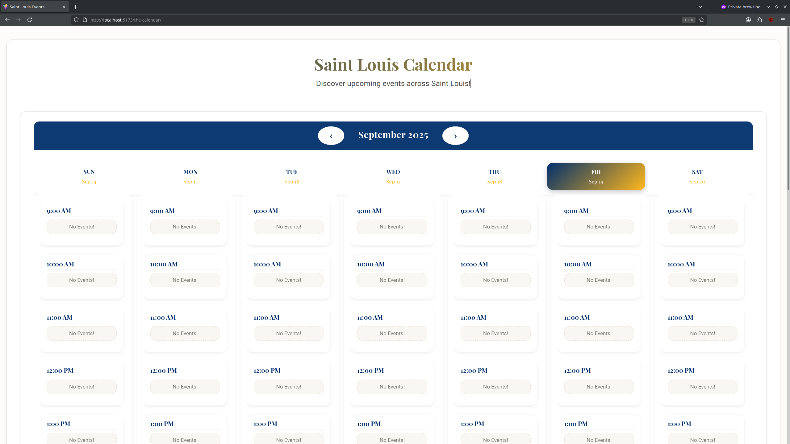

# Saint Louis Calendar

The **Saint Louis Calendar** is a React-based calendar, with the aim of providing an interactive and accessible way for the Saint Louis community to explore local events. This project enables community members to easily view events for a specific month, navigate between months, and display detailed events for selected days. Built using modern technologies like React, Vite, and CSS Grid/Flexbox.

> **Note**: This is a work-in-progress, and new features and enhancements are continuously being added!

## Features

- **Interactive Calendar**: View and interact with a calendar of the current month.
- **Month Navigation**: Seamlessly navigate between months using intuitive buttons.
- **Event Display**: View events for specific days and see event markers on days with scheduled activities.
- **Responsive Design**: The calendar adapts to different screen sizes using CSS Grid and Flexbox for a smooth user experience across devices.
- **Event Management**: Events are displayed dynamically using a dedicated backend API, which automatically adds new events from throughout the area.
  
## Technologies Used

- **React**: For building a dynamic and responsive user interface using functional components and React hooks.
- **Vite**: A modern, fast build tool and development server that optimizes performance for React apps.
- **CSS Grid & Flexbox**: For responsive layout design, ensuring the calendar looks great on all devices.
- **JSON File**: Events data is fetched from a local JSON file, allowing easy updates and management of events.

## Screenshots



> **Link**: Calendar: https://mcckyle.github.io/the-calendar/

## Installation

To get the project running locally, follow these steps:

1. Clone the repository:
   ```bash
   git clone https://github.com/your-username/saint-louis-calendar.git
   ```

2. Navigate into the project directory:
   ```bash
   cd saint-louis-calendar
   ```

3. Install the dependencies:
   ```bash
   npm install
   ```

4. Run the development server:
   ```bash
   npm run dev
   ```

   The app will go live at `http://localhost:3000`.

## Project Status & Roadmap

- **Current Status**: This project is in its early stages, with a fully functioning calendar interface, event viewing, and month navigation.
- **Upcoming Features**:
  - User authentication for adding/editing events.
  - Drag-and-drop event scheduling.
  - Event reminders and notifications.

## Contributing

This project is open-source and actively welcomes contributions. Here's how you can get involved:

1. **Fork the repository** and clone it to your local machine.
2. Create a **new branch** for your feature or bug fix.
3. **Make changes** and commit them with descriptive messages.
4. **Push** your changes to your forked repository.
5. **Submit a pull request** outlining the changes you made and the problem they address.

Please feel free to **open an issue** for any bugs, improvements, or new feature suggestions.

## License

This project is licensed under the MIT License - see the [LICENSE](LICENSE) file for details.

## Acknowledgements

- **React**: A JavaScript library for building user interfaces. Special thanks to the React team for creating such a powerful and flexible tool.
- **Vite**: A next-generation build tool that provides fast development and optimized production builds. Thanks to the Vite team for their excellent tool.
- **CSS Grid & Flexbox**: Thank you to the CSS working group for developing these modern layout techniques that allowed for a responsive and user-friendly design.
- **Open Source Community**: A huge thank you to the open-source community for providing numerous resources, tutorials, and libraries that made the development of this project much easier.
- **Saint Louis Community**: Special thanks to the vibrant Saint Louis community for inspiring the creation of this calendar, and for providing a wealth of cultural and community events that enabled the project and content.
